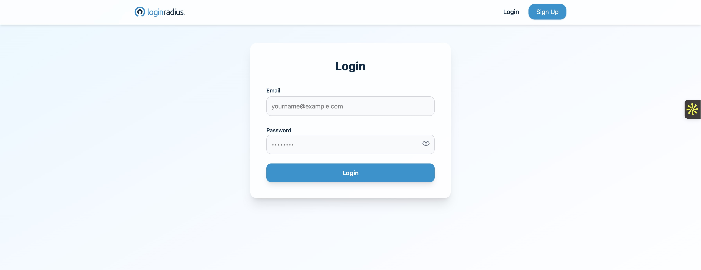
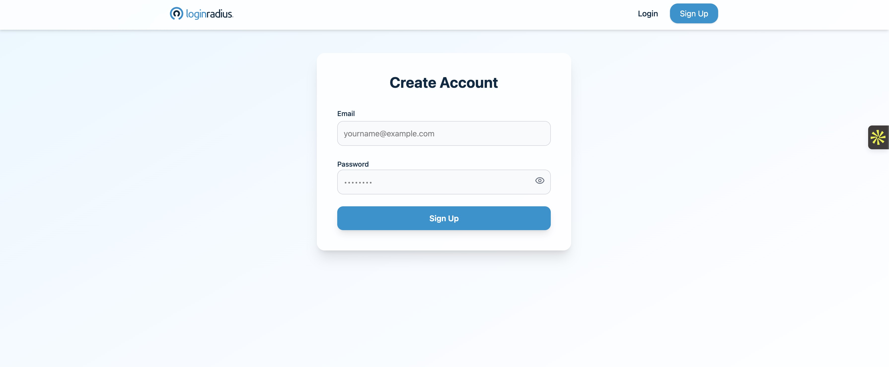
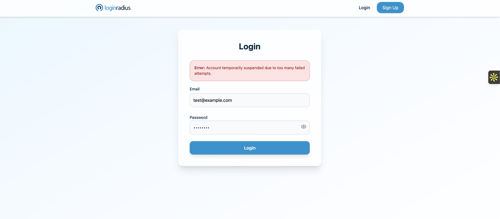
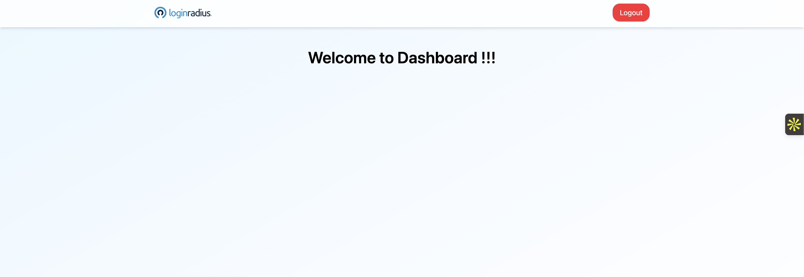

# Brute-Force Protected Login System

A full-stack login application implementing user-level lockout, IP-level lockout, and JWT-based authentication. Built using React, Node.js/Express, and MongoDB, then deployed on Netlify and Render.

### Note:
Test Credentials:

  Email: test@example.com
  Password: Secret123

Also you can signup just in case you prefer not to use the test credentails. And please be aware that the first login attempt may take slightly longer than usual, as the frontend, backend, and database are hosted on different platforms. Subsequent logins will perform smoothly.

## Setup Instructions
### Backend:
1.Navigate to /backend

2:Install dependencies: npm install
  
3: Add .env file
  
    MONGO_URI=your_mongodb_uri
    
    JWT_SECRET=your_secret_key
    
    USER_LOCK_THRESHOLD=5
    
    IP_LOCK_THRESHOLD=100
    
    LOCKOUT_DURATION_MINUTES=15
    
4: Start server: node server.js

### Frontend:
1. Navigate to /frontend

2. Install dependencies: npm install

3. Add .env file:
    VITE_API_URL = https://your-backend-url.onrender.com/api

4. Start dev server: npm run dev

## Architecture & Design Decisions
### Backend:

1. Built with Node.js + Express

2. Uses MongoDB with TTL collections to auto-expire failed login attempts

3. Brute-force protections:
    User Lockout: Account locked for 5 minutes after 5 failed attempts
    IP Lockout: Blocks an IP after too many (100) failed attempts across any user
    Stateless authentication using JWT

### Frontend:

1. Built with React + Vite

2. Uses localStorage for token storage

3. Protected routes and authentication-aware navigation

4. Clean Tailwind UI components for login, signup, and dashboard

5. Modern error handling and alert system

## Hosting Details

1. Frontend: Deployed on Netlify
    Build command: npm run build
    Publish directory: dist/

2. Backend: Deployed on Render
    Auto-deploys from GitHub
    Environment variables configured in Render dashboard

## Screenshots

